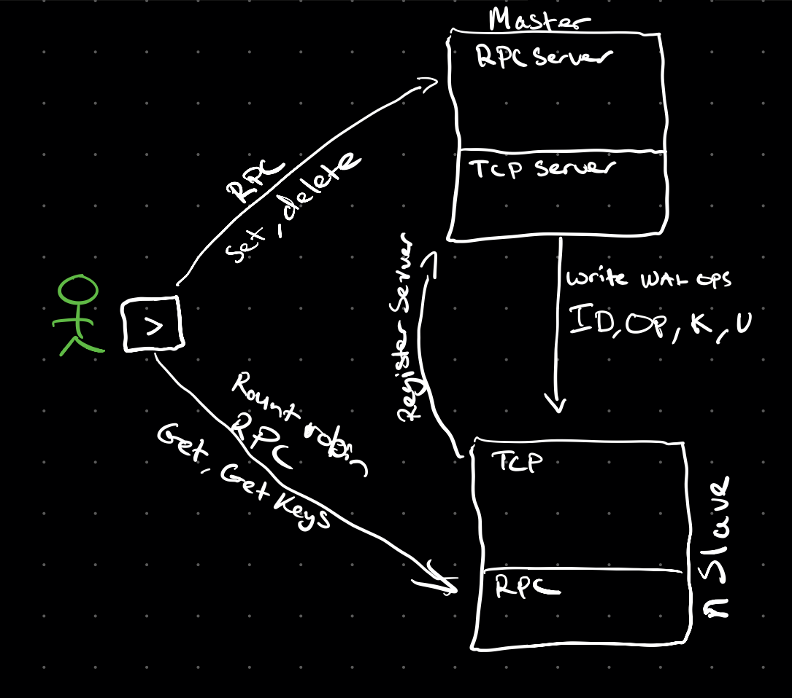

# hydrakv

## 29/11 update
- Focus moved from distribution of work to the storage and retrieval aspects of db design
- Will look to implement a WAL and scalable storage platform

>>>>>>>>>>>>>>>>>>>>>>>>>>>>>>>>>>>>>>>>>>>>>>>>>>>>>>>>>>>>>>>>>>>>>>>>>>>>>>>><

HydraKV is a simple key value store for learning purposes.

Longer term learning opportunities include having read only distributed slaves

## Operations 
- PUT -> Put key and value into dataset
- GET -> Get value from dataset
- DELETE -> Delete k,v from dataset
- GETALL -> Get all keys in dataset

## TODO
- Write ahead log
- Remove JSON and have hydra storage 'engine'
- Separate DB server elements from public API elements
- Multiple Datasets 
- ~~LOAD from JSON~~
- ~~DUMP to JSON~~
- ~~Put operator~~
    - If you put an existing key what happens?
        - Should overwrite, TODO
- ~~Get operator~~
- ~~Delete operator~~
- ~~Figure out how to do operators while checkpointing to file~~
    - Optimise?
- ~~Get all operator~~
- ~~Master write~~
- ~~Slave read~~ 

## Distribution
### Master
- Handles all PUT, DELETE operations
- Interfaces client connection and sends to slave for read
- Sends WAL stream

### Slave
- Handles all read operations
- Register with Master
- Reads WAL stream and implements on local db
